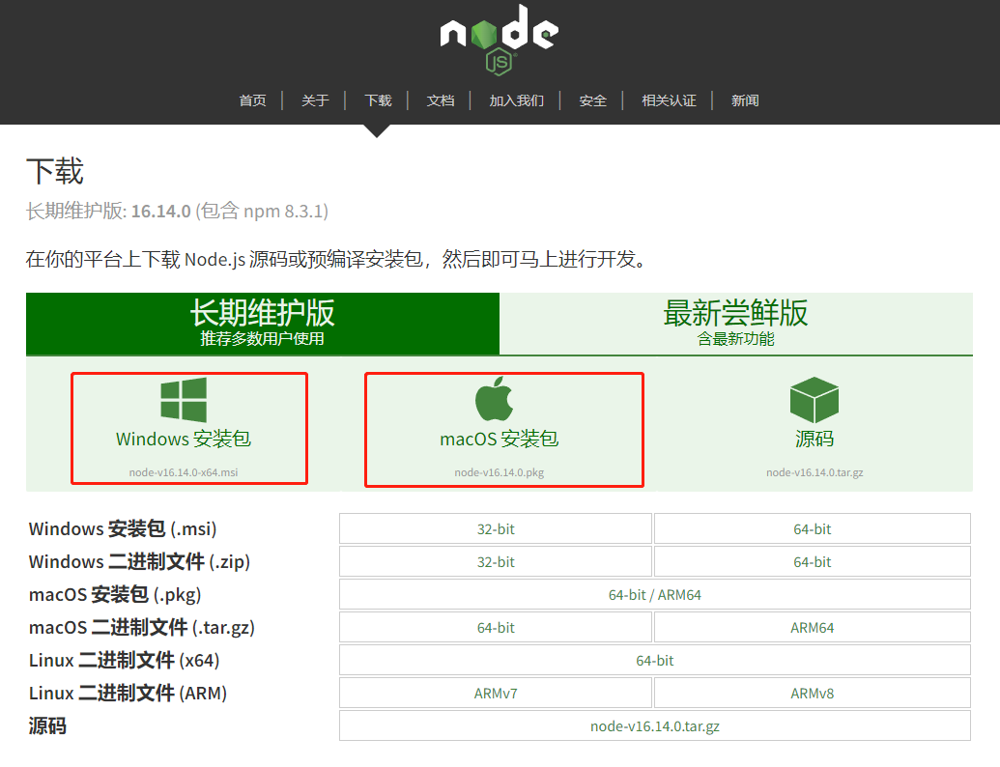

但至少，我得介绍一下“什么是编程”之类的问题（这很重要），以及需要的准备工作。

### 编程、编程语言
> 为了避免咬文嚼字，下面的内容可能不够严谨  
> 如果追求严谨的话，“编程”、“编程语言”可能两天两夜都讲不明白  

电脑、手机上，可以安装一些“APP”。  
APP 就是程序。  
而程序，就是一个或一些文件，在这个或这些文件中，有很多“命令”。  
比如，在“爱奇艺”程序里，可能有这样一些命令：
```
在屏幕底部，显示一个按钮；
当这个按钮被点击时，开始播放视频；
当这个按钮再次被点击时，暂停播放视频；
```
这些**命令是程序员写给电脑的，电脑会执行这些命令**。

编程，就是“编写程序”，或“写程序”。  
电脑会按程序中的“命令”，完成它的任务。  

当然，上面那个“爱奇艺”不是真正的程序。  
真正的程序往往是用拉丁字母写的，**看起来很像英语，但绝不是英语**。（所以“英语不好”对编程几乎没影响）。  
写程序，不用英语，也不用汉语，而是有专门的“编程语言”。  
这种语言是专门为“写程序”而设计的。  
编程语言的设计者，往往要考虑两个因素：
+ 电脑要看得懂
+ 程序员要会说

汉语、英语，往往对人类友好，而电脑很难“学会”，你可以看看[雷老板和小爱同学的对话日常](https://www.bilibili.com/video/BV18t411D7Cm)。（看完别忘了回来学习！）  

所以学习编程，一开始，往往要学一门编程语言。  
是的，像人类世界一样，电脑的世界也有很多语言。  
比如鼎鼎大名的“C语言”、“Java”、“Python”。  
但本教程打算介绍一个“名声不那么好”的语言：JavaScript。  
名声有多不好呢，甚至业界有一本著名的书，里面介绍 JavaScript 的缺点。  
但是 JavaScript 可能是使用者最多的语言，至少是“最多之一”，因为它活跃在多个领域。  
编程界有一句话：没有垃圾语言，只有没人用的语言。  
而且，“名声不好”往往是因为偏见，就像地域黑、种族歧视。  

但语言的选择其实是其次。  
本教程的目的在于通过 JavaScript 介绍“如何编程”，而并不怎么关注 JavaScript 本身。  
你只要会编程，不论是 Java 还是 C 还是 Python，都无所谓。  

选择 JavaScript，一个重要的原因，其实是“编程环境”的搭建比较容易。  
多少 Java 学习者，连“环境搭建”这一关都过不去……  

### 环境搭建
一个工厂，造玩具，需要“生产车间”，车间里会有一些机器。  
“造”程序，也要“生产车间”，一般都是在电脑上“造”。  
而且需要一些“机器”（就是在电脑上安装一些程序）。  

人不可能懂所有的人类语言，如果他会七门外语，那他可能就很厉害了。  
电脑也“不懂”所有的编程语言。  
但我学英语要每天读很多文本，读几年。  
而电脑“学习” JavaScript，直接把“知识”安装进去就可以了，真是羡慕至极。  
这种“JavaScript 知识”往往以程序的形式，安装在电脑上。  
我多想把《牛津词典》输入我的大脑……  

英语有《牛津词典》、《韦氏词典》……每种词典都有不同的版本。  
JavaScript 也有多种“词典”，也有不同的版本。  
Node.js 是一个重要的“词典”。  
[这个链接：https://nodejs.org/zh-cn/download/](https://nodejs.org/zh-cn/download/) 可以下载 Node.js。  
直接下载“安装包”就可以了。  


下载好之后，你会得到一个 ```.msi``` 或 ```.pkg``` 文件，双击后，一直点“下一步”或“继续”就可以了。  
安装之后，在“控制台”验证一下，是否安装成功。  
##### 如果你用的 windows 电脑
+ 同时按下键盘上的 win 和 r 键（win 键一般在 ctrl 和 alt 中间）
+ 在弹出的窗口里，输入 ```cmd```，再按回车
+ 弹出的黑乎乎的窗口，就是控制台

##### 如果你用的 mac 电脑
+ “控制台”是 mac 上的一个程序，在“程序菜单”里找到，点一下就行了
+ mac 的控制台往往是个白色的窗口

##### 打开控制台之后
在控制台输入 ```node -v``` 回车，如果你看到类似 ```v.14.15.4``` 的东西，就说明，安装好了。

### 注意
JavaScript 读作：扎沃丝哥瑞泼特  
中文没有字母 V 对应的发音，但我想你应该知道怎么读  
